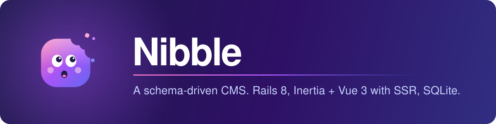

<p align="center">
  
</p>

# Nibble

A schema-driven CMS. Rails 8 serves the public site and the control panel through Inertia + Vue 3 with
server-side rendering. Collections, taxonomies, globals, navigation, assets and forms are defined in YAML
(Nibble's own, then the theme's, then yours), and their content lives in SQLite.

You run Nibble as your whole application: clone it, install it, and make the site yours through your own theme,
your own schema and your own settings. Upgrades arrive as releases you merge.

## Stack

- **Backend:** Rails 8, SQLite (WAL) for app data plus Solid Queue/Cache, Active Storage on S3 in production and staging (local disk in development)
- **Frontend:** Inertia Rails + Vue 3, SSR via a Node process (Vite), Tailwind v4, shadcn-vue for the control panel, Tiptap for rich text
- **Deploy:** Kamal on a VPS behind Thruster; nightly `VACUUM INTO` database backups kept locally and offsite

## Requirements

git, Ruby, Node, npm, SQLite, libvips and ffmpeg. Ruby and Node versions are pinned in `mise.toml`
([mise](https://mise.jdx.dev) picks them up with `mise install`). Nothing else is needed — SQLite backs the
database, the cache and the job queue.

## Install

```
./install.sh my-site
```

It checks the machine has what it needs, fetches Nibble and hands over to `bin/rails nibble:install`, which asks
for your site's details, writes the files you own, prepares the database, creates your administrator and offers
the theme's example content.

In a checkout you already have:

```
bin/rails nibble:install
```

Then `bin/dev` and sign in at `/admin`.

## What belongs to you

Nibble never writes to these, so upgrades leave them alone:

| Path | Holds |
|---|---|
| `schema/` | your collections, blueprints, taxonomies, globals, navigation and forms |
| `themes/<yours>/` | your theme |
| `site/` | control panel overrides, slots and your own initializers |
| `config/nibble.yml`, `.env`, `config/deploy*.yml` | your settings, generated at install |
| `db/migrate`, `Gemfile.local` | your migrations and gems |

Everything else is Nibble's. To change one of its files, `bin/rails nibble:eject <path>` copies it into `site/`
and records that you now maintain it, so `bin/rails nibble:check` can tell you when the original moves on.

## Running it

```
bin/dev
```

Rails on port 3100 and the Vite dev server on 3136 (`Procfile.dev`).

## Making things

```
bin/rails nibble:generate:collection guides
bin/rails nibble:generate:taxonomy regions
bin/rails nibble:generate:blueprint guides/gallery
bin/rails nibble:generate:form enquiry
```

Also `fieldset`, `global` and `navigation`. Each writes a valid stub into `schema/` and refreshes the theme's
generated types. Run `bin/rails nibble:check` afterwards.

## Configuration

Settings live in `config/nibble.yml`, which holds only what you set — everything else has a default in code. These
environment variables are read directly:

| Variable | Purpose |
|---|---|
| `SITE_URL` | Public site URL for canonicals, sitemaps, robots and mail links (development default `http://localhost:3100`) |
| `NIBBLE_THEME` | The active theme in `themes/` (default `crumbs`) |
| `NIBBLE_BLOCK_INDEXING` | Any value makes `robots.txt` disallow crawling, adds a `noindex` robots meta tag and leaves analytics off, even in production |
| `SMTP_ADDRESS`, `SMTP_PORT` | Outgoing mail in production and staging (username and password come from credentials) |
| `AWS_REGION`, `AWS_BUCKET_NAME` | S3 storage for uploads in production and staging |
| `DB_SNAPSHOT_BUCKET`, `DB_SNAPSHOT_REGION` | Where the nightly database backup is uploaded |
| `BASIC_AUTH_USER`, `BASIC_AUTH_PASSWORD` | Staging's HTTP Basic Auth when booting staging locally |
| `NIBBLE_SECRET_<NAME>` | Secrets for outbound API connections, one per name in `outbound.secrets` |

CAPTCHA keys, the mail sender and analytics IDs are site settings in the **Integrations** global, not environment
variables.

In production and staging, Nibble checks these before it serves: a missing or wrong setting stops the boot and
names every problem at once. A console or a migration still starts, so a broken setting can be fixed in place.

## Tests and checks

```
bin/ci
```

Runs the same checks as CI (`config/ci.rb`): RuboCop, ESLint, Prettier, `vue-tsc`, frontend unit tests,
gem and code security scans, a production build of both the client and SSR bundles plus an SSR smoke test, the
Rails test suite and the seeds. Individually:

```
bin/rails test              # Ruby tests (build test assets first if Vite hasn't: RAILS_ENV=test bin/vite build)
npm run lint                # ESLint
npm run format:check        # Prettier
npm run check               # vue-tsc
npm run test:js             # frontend unit tests
bin/rubocop                 # Ruby style
bin/ssr-smoke               # renders pages through a freshly built SSR bundle
```

## Themes and content

The public site is rendered by the active theme in `themes/<handle>` (default `crumbs`, override with
`NIBBLE_THEME`). A theme's example content is a content package under `themes/<handle>/content`.

```
bin/rails nibble:admin:create                # add a user: name, email, password and role, all asked for
bin/rails nibble:generate:theme almanac      # this site's own theme, copied from the starter
bin/rails nibble:generate:view guides/index --collection=posts   # a view and its query sidecar
bin/rails nibble:check                       # schema, theme, roles, settings, pending migrations, ejected files
bin/rails nibble:check --support             # a summary of this install to paste into an issue
bin/rails nibble:content:validate themes/crumbs/content
bin/rails nibble:content:import              # the active theme's package; --mode=update, --dry-run, --webhooks
bin/rails nibble:content:export tmp/package  # --collections=posts,pages --locales=en --status=published
bin/rails nibble:content:migrate --dry-run   # pending schema/migrations/*.yml
bin/rails nibble:schema:types                # regenerate the theme's .nibble/types.d.ts (checked by nibble:check)
bin/rails nibble:search:rebuild
bin/rails nibble:assets:purge_unused         # lists unused assets and stray uploads; --confirm, --older-than-days=1
bin/rails nibble:dev:seed                    # about 120 demo posts for local testing (development only)
RAILS_ENV=test bin/rails nibble:bench        # public render and CP listing budgets; --posts, --requests
```

Every command lists its options with `--help`, for example `bin/rails nibble:content:import --help`.

## End-to-end tests

`test/e2e/` holds Playwright scripts, run from the repo root against a dev server. Install them once with
`(cd test/e2e && npm install && npx playwright install chromium)`.

```
node test/e2e/cp-e2e.mjs http://localhost:3100 EMAIL PASSWORD_FILE          # control panel round trip + axe on every screen
node test/e2e/crumbs-e2e.mjs http://localhost:3100                          # public pages, hydration and axe
node test/e2e/nibble-playground-e2e.mjs http://localhost:3100 EMAIL PASSWORD_FILE
node test/e2e/cp-screenshots.mjs http://localhost:3100 EMAIL PASSWORD_FILE  # screenshots of every CP screen
```

The playground (`/admin/nibble/playground`, development only) renders every schema blueprint plus a kitchen-sink
blueprint using all core fieldtypes, backed by in-memory demo records.

## Deployment

Kamal deploys the Docker image to one server per environment (SQLite and uploads live on the `storage` volume).
The image runs Puma behind Thruster; the `inertia_ssr` Puma plugin runs the Node SSR server in the same container,
and Solid Queue runs inside Puma for scheduled publishing.

```
bin/kamal setup                 # first deploy to a new server (add -d staging for staging)
bin/kamal deploy
bin/kamal deploy -d staging
bin/kamal console               # also: shell, logs, dbc (add -d staging)
```

Every container runs `bin/rails nibble:upgrade` before the server starts: it refuses a theme built for another
Nibble version, runs database and content migrations, runs `nibble:check` (which refuses a schema change that would
strand stored content), and records the schema. If it refuses, the new container never becomes healthy, Kamal keeps
the old one serving, and the container log says why; `--allow-data-loss` is the deliberate override. Database
migrations run before that check, as in any Rails deploy, so write them to work with the release still serving.

Before the first deploy:

- `config/deploy.yml` and `config/deploy.staging.yml` are generated by the install. Add them with
  `bin/rails nibble:install --only=deploy` if you skipped it.
- Secrets: `.kamal/secrets` and `.kamal/secrets.staging` read `RAILS_MASTER_KEY` from
  `config/credentials/<environment>.key` and `KAMAL_REGISTRY_PASSWORD` from that environment's credentials.
  Key files are gitignored — keep your own backup.
- Credentials: `bin/rails credentials:edit --environment production` (or `staging`). Each environment needs
  `kamal_registry_password`, `smtp.username` / `smtp.password`, `aws.access_key_id` / `aws.secret_access_key`,
  and `nibble.secrets.<name>` for any outbound API connection that uses a secret. Staging also needs
  `basic_auth.username` / `basic_auth.password`.
- S3 buckets per environment (override the name with `AWS_BUCKET_NAME`). They don't need to be public: images are
  served through Rails. The control panel uploads straight from the browser, so each bucket needs a CORS rule for
  its own site:

  ```json
  [
    {
      "AllowedOrigins": ["https://your-site.example"],
      "AllowedMethods": ["PUT"],
      "AllowedHeaders": ["Content-Type", "Content-MD5", "Content-Disposition"],
      "MaxAgeSeconds": 3600
    }
  ]
  ```

- The health check is Rails' `/up`. Staging sends `X-Robots-Tag: noindex` and its `robots.txt` disallows indexing.
- Staging sits behind HTTP Basic Auth, everything except `/up` — Kamal's health check must stay reachable without
  credentials. Requests fail with a clear error if neither credentials nor environment variables are set, rather
  than silently allowing access. Production has no Basic Auth.
- CDN: a proxying CDN in front of the app domain works without a cache rule. Asset URLs (`/assets/<uuid>/...`,
  versioned by content and crop) and the Vite build already return long-lived `Cache-Control` headers. HTML stays
  uncached (`Cache-Control: private`) on purpose — caching a full page would share one visitor's session and CSRF
  token with another.
- Nightly database backup (`DatabaseSnapshotJob`, 3am): `VACUUM INTO` gives a compacted, consistent copy of the
  primary database in one step, gzipped and kept for 7 days on the server's persistent volume
  (`storage/backups/`) and uploaded to `DB_SNAPSHOT_BUCKET` if one is set. Cache, queue and cable databases are
  not backed up — they are ephemeral. See `docs/runbooks/restore.md` for the restore procedure.

## Upgrading

Releases are tags. **Upgrade on your own machine, check the result, then deploy it** — never in place on a
server, which the command refuses to do. Commit a clean tree first: that is what lets you undo anything it does.

`bin/nibble-upgrade [version]` takes the newest release, or the one you name. It snapshots the database and
prints the command that puts it back, checks the release can upgrade from your version and that your machine
meets its Ruby and Node floors, merges, installs dependencies and runs `bin/rails nibble:upgrade`.

Two kinds of file a merge cannot decide for you, so it asks:

- **Files you own that we generate** — `config/nibble.yml`, `.env`, the deploy files. If our template has moved
  on, it re-renders yours from the answers your install recorded and offers it, with a diff. Your `load_defaults`
  is kept, so new behaviour still stays off.
- **Files you ejected.** For each one it shows what changed in our copy since you took yours, so you can decide
  what to carry across.

`package-lock.json` is the one file both of us write — your own theme or packages have to go in it. The upgrade
rebuilds it for you; if git stops on a conflict there, take either side and run `npm install`.

The way back has a boundary, and the command names it as it crosses: until the migrations run, `git merge --abort`
undoes everything; after them, restore the snapshot it printed. A release whose migrations cannot be undone says so
in `CHANGELOG.md`, which is also where anything a release needs from you is written.

New behaviour ships switched off: raising `load_defaults` in `config/nibble.yml` is what turns it on, so taking a
release never changes how your site behaves on its own.

**Updates** in the sidebar carries a count of the releases newer than yours, what each one changed, and the command
to take it. Once a day in the background Nibble reads the release file it publishes and remembers two things — how
many releases are waiting and whether any is a security fix — so every page can show that instantly without asking
anyone. Opening Updates reads the file again, so what you are looking at is current. Reading that file is all that
happens — nothing about your site is sent anywhere — and a switch on that screen stops even that. There is nothing
to configure. Nibble never updates itself: the control panel hands you the command, and you run it on your own
machine.

## Licence

MIT — see `LICENSE`. Use it, change it, sell it, rebrand the control panel; keep the copyright notice with copies.
It comes with no warranty and no support promise.
